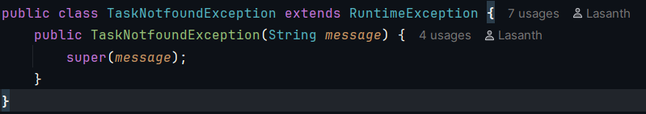
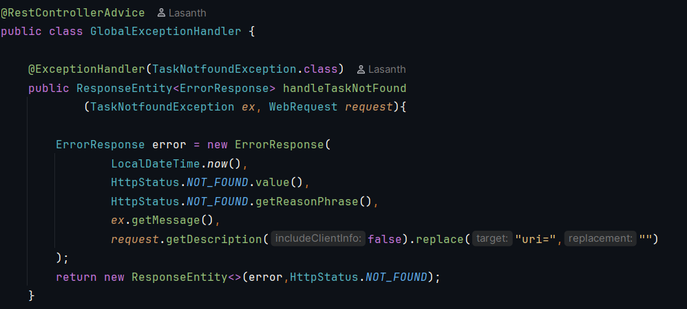
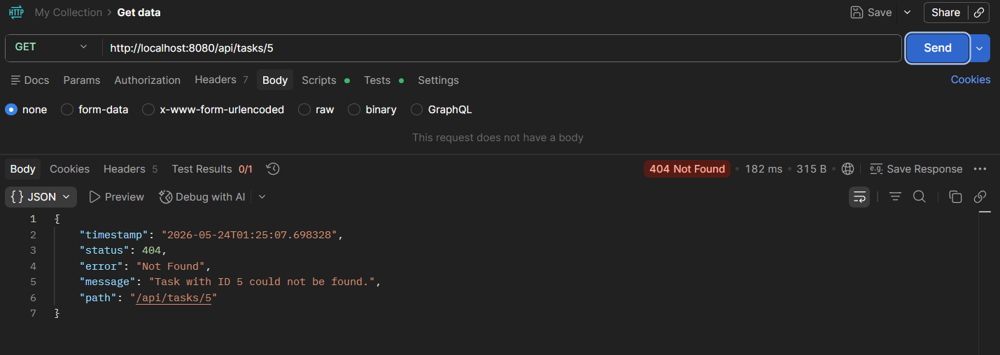
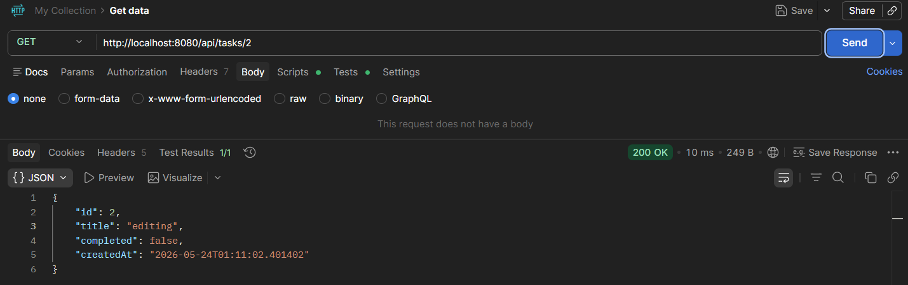

# TaskFlow – Task Manager (Springboot)
## Backend Focused on Global centralized exception handling
 
A back-endtask management built using **Spring Boot**

TaskFlow allows to do CRUD operations through backend architecture which has **Centralized exception handling**, immutable DTO usage, and compile-time object mapping.


## Backend
- Java 21
- Spring Boot 3
- Spring Data JPA
- Lombok
- MapStruct
- Java Records (DTOs)

---

## Features
- RESTful API architecture
- Layered enterprise architecture
- Global centralized exception handling
- Immutable DTOs using Java Records
- Compile-time entity mapping using MapStruct
- Partial updates using PATCH
- Structured JSON error responses
- Clean separation of concerns

---

# 🧠 Architecture Overview


```
REST API Communication
        ↓
Spring Boot Controllers
        ↓
Service Layer
        ↓
Repository Layer (JPA)
        ↓
Postgres Database
```

---

# 📂 Project Structure

```text
taskflow/
│
└── taskflow/
    ├── controller/
    ├── dto/
    ├── entity/
    ├── exception/
    ├── mapper/
    ├── repository/
    └── service/
```

---

# 🛡️ Exception Handling & Error Strategy

This backend implements a unified, strict error response strategy. Instead of allowing default Spring container error stack traces to leak to the client, all runtime discrepancies are intercepted globally.

## 1.Standard Error Payload

Every single failed request returns an identical JSON structure, making it highly predictable for frontend error parsing:

```json
{
  "timestamp": "2026-05-24T01:38:05.123456",
  "status": 404,
  "error": "Not Found",
  "message": "Task with ID 5 could not be found.",
  "path": "/api/tasks/5"
}
```
---

## 2. Architectural Flow

- **Encapsulation:** Custom business exceptions like `TaskNotFoundException` accept raw data (such as the missing target ID) directly into their constructor. The string formatting logic lives entirely within the exception class, keeping the call-site inside the service layer clean and declarative (`throw new TaskNotFoundException(id);`).

- **Global Interception:** The `GlobalExceptionHandler` uses `@ControllerAdvice` and `@ExceptionHandler` methods to intercept runtime exceptions and map them to a structured `ResponseEntity<ErrorResponse>`.

- and also @JsonInclude(JsonInclude.Include.NON_NULL) applied on response DTOs, ensuring null fields are excluded from JSON output.

---

### 📌 API Endpoint Reference

| Method | Endpoint | Description | Status Code |
|--------|----------|-------------|-------------|
| GET | `/api/tasks` | Get all tasks | 200 OK |
| GET | `/api/tasks/search?completed=true` | Search tasks (by completion status) | 200 OK |
| POST | `/api/tasks` | Create a new task | 201 Created |
| PUT | `/api/tasks/{id}` | Full update of a task | 200 OK |
| PATCH | `/api/tasks/{id}` | Partial update of a task | 200 OK |
| DELETE | `/api/tasks/{id}` | Delete a task | 204 No Content |

---

### 📸 Few Postman Testing screenshots

#### 1. Get Tasks by @RequestParam (completed = true)


#### 2. Error JSON payload (id=5 not found)


#### 3. Ignore null fields(description ignored)


#### 4. Patch description field only


