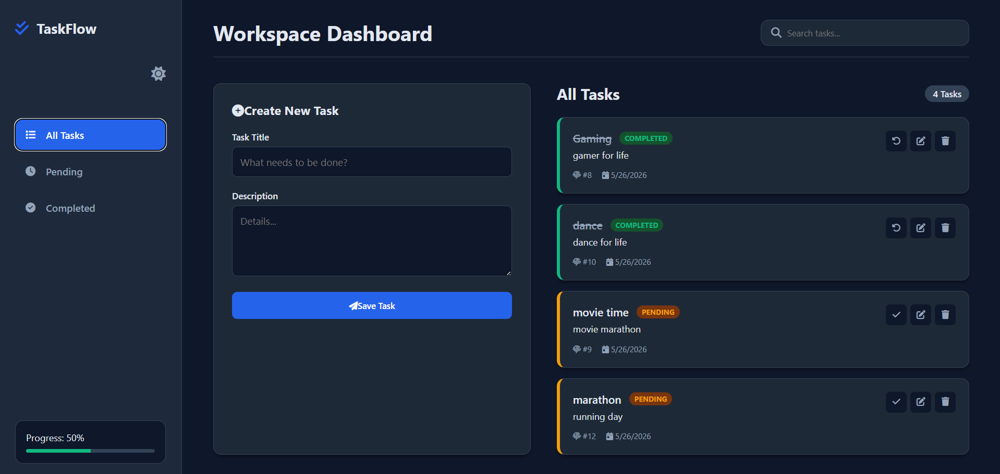
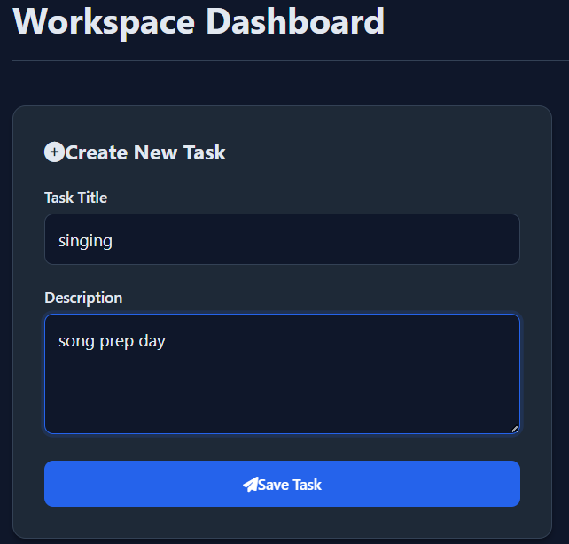
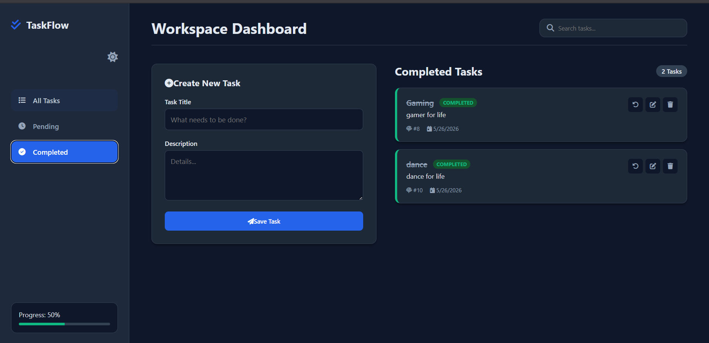
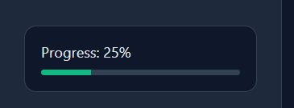
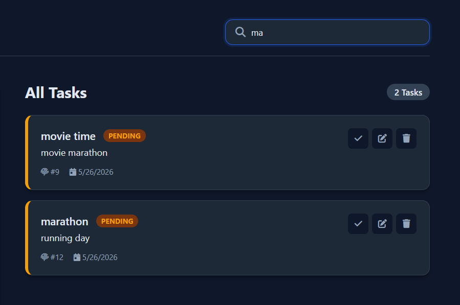
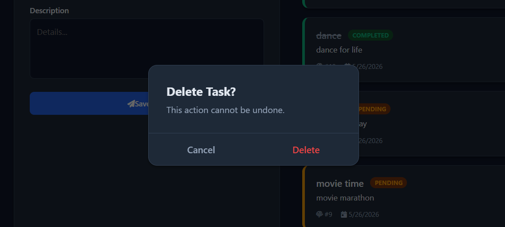
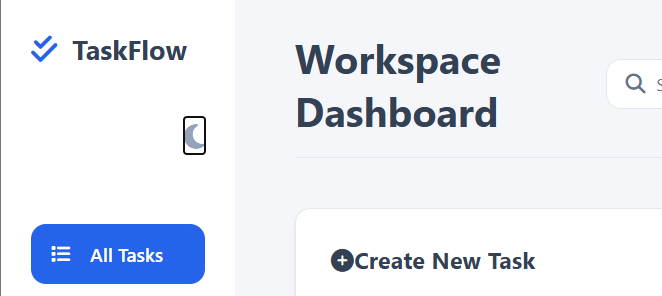

# TaskFlow – Task Manager (Springboot/React)
## Backend Focused on Global centralized exception handling
 
A modern full-stack task management application built using **React + Vite** for the frontend and **Spring Boot** for the backend.

TaskFlow allows users to create, update, search, filter, complete, and delete tasks through a responsive dashboard interface while showcasing enterprise-level backend architecture, **Centralized exception handling**, immutable DTO usage, and compile-time object mapping.


### Front preview

#### 1. Dashboard Overview


#### 2. Create Task Form


#### 3. Task Filtering


#### 4. Progress Tracking


#### 4. Search Functionality


#### 5.  Delete Confirmation Modal


#### 6. Dark Mode Interface



# 🚀 Tech Stack

## Frontend
- React 18
- Vite
- JavaScript (ES6+)
- CSS3
- Font Awesome
- Fetch API

## Backend
- Java 21
- Spring Boot 3
- Spring Data JPA
- Lombok
- MapStruct
- Java Records (DTOs)

---

# ✨ Features

## Frontend Features
- Create tasks
- Edit existing tasks
- Delete tasks with confirmation modal
- Mark tasks as completed/pending
- Live search functionality
- Filter tasks:
  - All Tasks
  - Pending Tasks
  - Completed Tasks
- Progress tracking bar
- Dark mode support
- Responsive dashboard UI
- Smooth modal animations

## Backend Features
- RESTful API architecture
- Layered enterprise architecture
- Global centralized exception handling
- Immutable DTOs using Java Records
- Compile-time entity mapping using MapStruct
- Partial updates using PATCH
- Structured JSON error responses
- Clean separation of concerns

---

# 🧠 Architecture Overview

The application follows a layered architecture:

```text
Frontend (React)
        ↓
REST API Communication (Fetch API)
        ↓
Spring Boot Controllers
        ↓
Service Layer
        ↓
Repository Layer (JPA)
        ↓
Postgres Database
```

---

# 📂 Project Structure

```text
taskflow/
│
├── taskflow-frontend/
│   ├── src/
│   │   ├── components/
│   │   │   ├── ConfirmModal.jsx
│   │   │   ├── Sidebar.jsx
│   │   │   ├── TaskCard.jsx
│   │   │   └── TaskForm.jsx
│   │   ├── App.jsx
│   │   ├── main.jsx
│   │   └── index.css
│   │
│   ├── public/
│   ├── package.json
│   └── vite.config.js
│
└── taskflow-backend/
    ├── controller/
    ├── dto/
    ├── entity/
    ├── exception/
    ├── mapper/
    ├── repository/
    └── service/
```

---

# 🎨 Frontend UI Components

## Sidebar
- Task filtering navigation
- Progress tracking
- Dark mode toggle

## Task Form
- Create new tasks
- Edit existing tasks
- Controlled form handling

## Task Cards
- Dynamic task status badges
- Toggle completion state
- Edit/Delete actions

## Confirmation Modal
- Animated delete confirmation dialog


### 🛡️ Exception Handling & Error Strategy

This backend implements a unified, strict error response strategy. Instead of allowing default Spring container error stack traces to leak to the client, all runtime discrepancies are intercepted globally.

### 1.Standard Error Payload

Every single failed request returns an identical JSON structure, making it highly predictable for frontend error parsing:

```json
{
  "timestamp": "2026-05-24T01:38:05.123456",
  "status": 404,
  "error": "Not Found",
  "message": "Task with ID 5 could not be found.",
  "path": "/api/tasks/5"
}
```
---

### 2. Architectural Flow

- **Encapsulation:** Custom business exceptions like `TaskNotFoundException` accept raw data (such as the missing target ID) directly into their constructor. The string formatting logic lives entirely within the exception class, keeping the call-site inside the service layer clean and declarative (`throw new TaskNotFoundException(id);`).

- **Global Interception:** The `GlobalExceptionHandler` uses `@ControllerAdvice` and `@ExceptionHandler` methods to intercept runtime exceptions and map them to a structured `ResponseEntity<ErrorResponse>`.

- and also @JsonInclude(JsonInclude.Include.NON_NULL) applied on response DTOs, ensuring null fields are excluded from JSON output.

---

### 📌 API Endpoint Reference

| Method | Endpoint | Description | Status Code |
|--------|----------|-------------|-------------|
| GET | `/api/tasks` | Get all tasks | 200 OK |
| GET | `/api/tasks/search?completed=true` | Search tasks (by completion status) | 200 OK |
| POST | `/api/tasks` | Create a new task | 201 Created |
| PUT | `/api/tasks/{id}` | Full update of a task | 200 OK |
| PATCH | `/api/tasks/{id}` | Partial update of a task | 200 OK |
| DELETE | `/api/tasks/{id}` | Delete a task | 204 No Content |

---

### 📸 Few Postman Testing screenshots

#### 1. Get Tasks by @RequestParam (completed = true)


#### 2. Error JSON payload (id=5 not found)


#### 3. Ignore null fields(description ignored)


#### 4. Patch description field only


