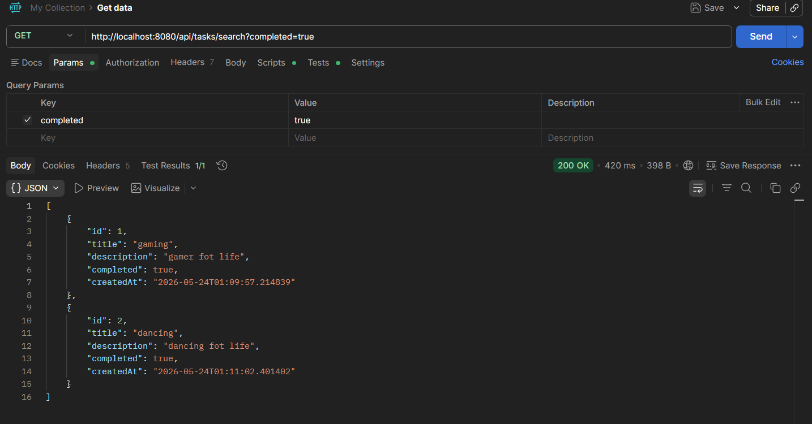
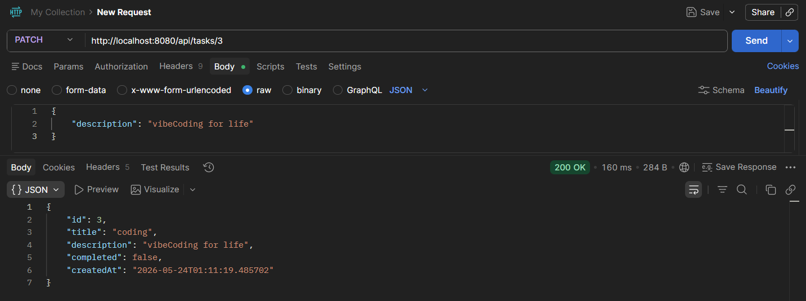

# TaskManager
### ( Focused on Global Exception Handling Mechanism)

A Spring Boot REST API for a Task Management application. This project showcases error-handling mechanism, layered architecture utilizing compile-time mapping, immutable data transfer objects (DTOs), selective partial updates.

---

## 🚀 Tech Stack & Features

- **Java 21 & Spring Boot 3** – Core application framework  
- **Spring Data JPA** – Database abstraction layer
- **Centralized Global Exception Handling** – Guarantees predictable, structured error payloads for frontend consumption 
- **Lombok** – Used exclusively on entities to eliminate boilerplate getter/setter code  
- **Java Records** – Used for immutable, secure Data Transfer Objects (DTOs)  
- **MapStruct** – High-performance, compile-time object mapping between Entities and DTOs  
 

---

## 📂 Project Structure

The project follows a highly organized, layered architecture grouped by architectural concern:

```text
little.taskmanager/
├── controller/
│   └── TaskController.java          # Exposes REST endpoints (ResponseEntity wrapper)
├── dto/
│   ├── ErrorResponse.java           # Standardized API error payload (Record)
│   ├── TaskPatchDto.java            # Loose DTO dedicated for PATCH updates (Record)
│   ├── TaskRequestDto.java          # Strict DTO for Creation/Full Updates (Record)
│   └── TaskResponseDto.java         # Secure outbound response payload (Record)
├── entity/
│   └── Task.java                    # Database Hibernate/JPA Entity (Lombok managed)
├── exception/
│   ├── GlobalExceptionHandler.java  # Centralized interceptor via @ControllerAdvice
│   └── TaskNotFoundException.java   # Custom business runtime exception
├── mapper/
│   └── TaskMapper.java              # MapStruct compiler-driven mapping layer
├── repository/
│   └── TaskRepository.java          # Data access abstraction
└── service/
    └── TaskService.java             # Business logic layer and transactional boundaries
```


### 🛡️ Exception Handling & Error Strategy

This backend implements a unified, strict error response strategy. Instead of allowing default Spring container error stack traces to leak to the client, all runtime discrepancies are intercepted globally.

### 1.Standard Error Payload

Every single failed request returns an identical JSON structure, making it highly predictable for frontend error parsing:

```json
{
  "timestamp": "2026-05-24T01:38:05.123456",
  "status": 404,
  "error": "Not Found",
  "message": "Task with ID 5 could not be found.",
  "path": "/api/tasks/5"
}
```
---

### 2. Architectural Flow

- **Encapsulation:** Custom business exceptions like `TaskNotFoundException` accept raw data (such as the missing target ID) directly into their constructor. The string formatting logic lives entirely within the exception class, keeping the call-site inside the service layer clean and declarative (`throw new TaskNotFoundException(id);`).

- **Global Interception:** The `GlobalExceptionHandler` uses `@ControllerAdvice` and `@ExceptionHandler` methods to intercept runtime exceptions and map them to a structured `ResponseEntity<ErrorResponse>`.

- and also @JsonInclude(JsonInclude.Include.NON_NULL) applied on response DTOs, ensuring null fields are excluded from JSON output.

---

### 📌 API Endpoint Reference

| Method | Endpoint | Description | Status Code |
|--------|----------|-------------|-------------|
| GET | `/api/tasks` | Get all tasks | 200 OK |
| GET | `/api/tasks/search?completed=true` | Search tasks (by completion status) | 200 OK |
| POST | `/api/tasks` | Create a new task | 201 Created |
| PUT | `/api/tasks/{id}` | Full update of a task | 200 OK |
| PATCH | `/api/tasks/{id}` | Partial update of a task | 200 OK |
| DELETE | `/api/tasks/{id}` | Delete a task | 204 No Content |

---

### 📸 Few Postman Testing screenshots

#### 1. Get Tasks by @RequestParam (completed = true)


#### 2. Error JSON payload (id=5 not found)


#### 3. Ignore null fields(description ignored)


#### 4. Patch description field only

